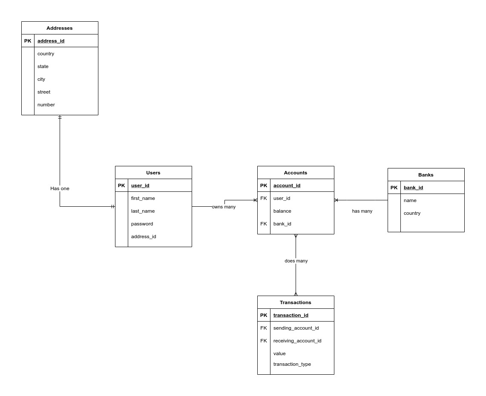

# Open Banking Back-end
## Welcome! :grin:
This project is a technical challenge for a selective process, so this documentation is made with the people that will be evaluating me in mind. But if you are just curious go ahead! You are also welcome here and I would love your feedback as well if you want to contact me!

## Summary
- [Stack]()
- [Database Modelling]()
- [Architecture]()
- [Strengths]()
- [Weaknesses]()
- [Difficulties]()
- [How to Run (this project)]()


## Stack
- Node.js
	- Express
	- Sequelize
- SQL
	- MySQL
- Testing
	- Chai
	- Mocha
	- Sinon
	
For this project I have decided to use a stack that is appropriate for the project but also one that I'm familiarized with. This way, the project will be able to run reliable and stable, but, at the same time it will alow me to show my programming logic and how I write my code, using some of my favorite technologies.

For the structure of the API i decided to use **Node.js**, a very well documented and powerful JavaScript runtime, associated with **Express** a very handful Node.js framework that will provide me with some useful set of tools. I will also be using **Sequelize**, a ORM for Node.js that supports the choosen database.

In the database i have decided to use **MySQL** a managed database service for SQL databases. The choice of a relational database was made thinking about its reliability in addition to the obvious ease of relating different tables that store different contents.

For testing purposes i will be using **Mocha**, a JavaScript testing framework that runs on Node.js and has a very useful set of tools, paired with **Chai** for assertions and **Sinon** for stubs.

## Database Modelling
After some thinking i have decided to implement a database as showed in the diagram below:



Clearly this database layout has some scalability and security issues, but it is designed to this project and will serve it's purpose. Ideally i would project a much larger and reliable one, but it's a project with a short deadline that I will be doing by myself. 

## Architecture

For this project i decided to use the MSC architecture, besides being very popular I'm used to use this architecture and it makes easier to divide the roles of each layer. The model layer will be created by the Sequelize.
## Strengths
I believe that the code of this application is very clean and the roles are well divided between the layers and functions. The folders are also well divided and it's a project easy to make maintenance and anyone with enough knowledge could make upgrades to it. Also, the Sequelize is of great help for the project, since with few command lines it's possible to create the database and the tables and populate them. 

The usage of the Express router resulted in a clean index.js and very easy to keep track of the logic and the data flow. And at last the SQL database provides a reliable and stable database to use with such sensitive data.

## Weaknesses
Since it is a full-stack project with a short deadline, i was not able to develop all the features that i wanted, so I will be listing some upgrades that are possible from my perspective.

- Tests
	- It's very evident the lack of both unit and integration tests in this API, when i first thought of this project my plans were to develop with the TDD standard, but the lack of time and some personal issues soon showed that it would not be possible, and as a result most of the application isn't tested.
- Verifications
	- The service layer is not making all the assertions that it should do, from the top of my head I can list two that i missed and didn't have the time to make it right: Email format and password, first name, and last name lengths
- Security Issues
	- I'm pretty sure that this API has some openings for SQL injection and sniffing, while developing the back-end i realized i never removed the user's password when responding with the JWT.

## Difficulties
So, i had some issues while developing this project. The first (and foolest) one is that I am really not sure what a open banking site does :shrug:.

The second and third one are directly related: issues of personal matter and lack of time. A lot of things had been happening in my life in the past few weeks, some good and some not that good, but both requiring some of my time, attention and energy. 

Another problem that i had: the requirements of this project were very vague. While I do understand that this may be the better way to evaluate someone's code and logic, I also am not used to projects like these so a lot of times I felt kind of lost and/or wasting time with things that wasn't that important.

And the last one is that this was an individual project, and everyone knows that programming in group is the best way to develop a good application. :grin:

## How to run
For the purpose of this step by step guide, I will be assuming that you are using a linux machine.

 1. First of all you need to clone this repository, open the terminal, clone the repository and change for the directory created:
	 ```bash
	 git clone git@github.com:Renan0211/open-banking-back-end.git
	 cd open-banking-back-end
	 ```
2. Secondly you have to install the dependencies:
	```bash
	npm install
	```
3. Now, you will have to create a file named `.env` in the root of the project (the directory you are right now). This file will tell the sequelize the credentials it will be using to run the mysql server. I have prepared a reference model below, just adjust the variables with your local username and password:
	```bash
	# This variables are for the sequelize
	MYSQL_USER=your_user_here

	MYSQL_PASSWORD=your_password_here

	MYSQL_DATABASE=open_banking #No need to change this line

	MYSQL_TEST_DATABASE=test_open_banking #No need to change this line

	HOSTNAME=localhost #No need to change this line

	  
	# This next line will be used by the JWT, you may change the
	# secret or not, it shouldn't make difference
	JWT_SECRET='super strong password here'
	
	#This line tells the API in wich port it should run, if you are
		# planning to use the front-end application for this API 
		# do not change it, but if you will use a tool like 
		# Postman you could change it and it shouldn't make
		# difference
	PORT=3001
	```

4. Then you will run the following commands to create the database and the tables and at last populate them:
	```bash
	# Make sure that you have the mysql running
	sudo systemctl start mysql
	# Creates the database
	npx sequelize db:create
	# Migrate the tables
	npx sequelize db:migrate
	# Populate the databases
	npx sequelize db:seed:all
	# If you have any problem you can drop all tables and
		# start again, but you will loose any data you have 
		# already inserted:
	npx sequelize db:migrate:undo:all
	```
5. Now you just have to start the API:
	```bash
	npm start
	```
6. (OPTIONAL) Go to my front-end repository [here](https://github.com/Renan0211/open-banking-front-end) and follow the instructions to see the other part of this project
